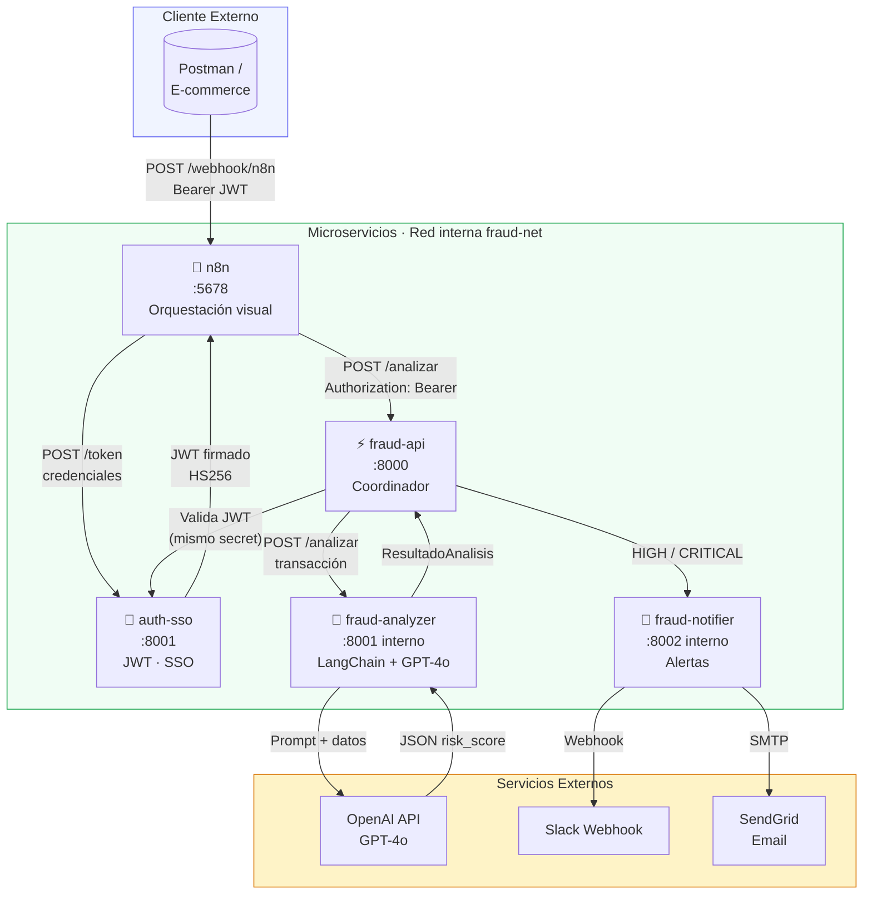

# Sistema de Detección de Fraude — Banca Chile


Pipeline de **detección de fraude en tiempo real** para transacciones financieras chilenas. Arquitectura de microservicios con autenticación SSO, análisis de riesgo con GPT-4o vía LangChain, orquestación visual con n8n y alertas automáticas.

> Diseñado para banca retail, fintech y e-commerce chileno. Compatible con integración a Azure Key Vault en producción sin cambios de código.

---

## Arquitectura



---

## Microservicios

| Servicio | Puerto | Tecnología | Responsabilidad |
|---|---|---|---|
| `auth-sso` | 8001 | FastAPI + python-jose | Emite y valida tokens JWT (HS256) |
| `fraud-api` | 8000 | FastAPI + httpx | Orquesta el flujo, valida JWT |
| `fraud-analyzer` | interno | LangChain + GPT-4o | Calcula risk score 0–100 |
| `fraud-notifier` | interno | FastAPI | Emite alertas Slack / email |
| `n8n` | 5678 | n8n | Orquestación visual del pipeline |

---

## Flujo completo: SSO + Detección de Fraude

```
[1] Postman / E-commerce envía credenciales a auth-sso
    POST http://localhost:8001/token
    Body: { "username": "...", "password": "..." }

[2] auth-sso valida credenciales y devuelve JWT firmado (exp: 30 min)
    Response: { "access_token": "eyJ...", "token_type": "bearer" }

[3] Cliente usa el JWT para llamar a fraud-api
    POST http://localhost:8000/analizar
    Header: Authorization: Bearer eyJ...
    Body: { transacción en JSON }

[4] fraud-api valida la firma JWT localmente (sin round-trip a auth-sso)
    → 401 si el token es inválido o expirado

[5] fraud-api llama a fraud-analyzer con los datos de la transacción
    → fraud-analyzer construye el prompt y llama a GPT-4o
    → GPT-4o devuelve JSON con risk_score, risk_level, recommendation

[6] Si risk_level ∈ {HIGH, CRITICAL}:
    fraud-api llama a fraud-notifier
    → fraud-notifier envía alerta a Slack y/o email

[7] fraud-api devuelve el resultado completo al cliente
    { transaccion_id, analisis, alerta_enviada, timestamp }
```

---

## Niveles de riesgo

| Score | Nivel | Acción | Descripción |
|---|---|---|---|
| 0–25 | `LOW` | APPROVE | Transacción dentro de parámetros normales |
| 26–50 | `MEDIUM` | APPROVE / REVIEW | Revisar si hay patrones repetidos |
| 51–75 | `HIGH` | REVIEW / BLOCK | Revisión manual urgente + alerta |
| 76–100 | `CRITICAL` | BLOCK | Bloqueo inmediato + alerta a equipo de fraude |

Factores evaluados por GPT-4o: monto inusual (> $1.500.000 CLP), horario nocturno (00:00–05:00), región diferente al historial, canal inusual, comercio sospechoso.

---

## Instalación

### Requisitos

- Docker Desktop >= 24 con Compose V2
- Python 3.11 (solo para generar datos sintéticos)
- API key de OpenAI con acceso a GPT-4o

### 1. Clonar y configurar secretos

```bash
git clone https://github.com/joseluisverag-hub/fraud-detection-chile
cd fraud-detection-chile

# API key de OpenAI
echo "sk-tu-clave-openai" > secrets/openai_key.txt

# Secreto para firmar JWT (genera uno aleatorio seguro)
openssl rand -hex 32 > secrets/jwt_secret.txt
```

### 2. Generar datos de prueba

```bash
cd data
python generate_transactions.py
# Crea: transactions_labeled.json (con etiquetas) y transactions_api.json (para el API)
cd ..
```

### 3. Levantar todos los servicios

```bash
docker compose up --build
```

### 4. Verificar que todo está sano

```bash
curl http://localhost:8001/health   # auth-sso
curl http://localhost:8000/health   # fraud-api
```

---

## Ejemplos de uso

### Obtener token JWT

```bash
curl -X POST http://localhost:8001/token \
  -H "Content-Type: application/json" \
  -d '{"username": "analista", "password": "fraude123"}'
```

```json
{
  "access_token": "eyJhbGciOiJIUzI1NiIsInR5cCI6IkpXVCJ9...",
  "token_type": "bearer",
  "expires_in": 1800
}
```

### Analizar una transacción sospechosa

```bash
TOKEN="eyJhbGciOiJIUzI1NiIsInR5cCI6IkpXVCJ9..."

curl -X POST http://localhost:8000/analizar \
  -H "Content-Type: application/json" \
  -H "Authorization: Bearer $TOKEN" \
  -d '{
    "id": "TXN-001",
    "rut_cliente": "12.345.678-9",
    "comercio": "CryptoExchange XY",
    "monto_clp": 8500000,
    "tipo": "transferencia",
    "region": "Magallanes",
    "hora": "03:47",
    "canal": "web"
  }'
```

```json
{
  "transaccion_id": "TXN-001",
  "analisis": {
    "risk_score": 94,
    "risk_level": "CRITICAL",
    "risk_factors": [
      "Monto inusualmente alto ($8.500.000 CLP)",
      "Horario nocturno (03:47)",
      "Región diferente al historial del cliente",
      "Comercio sospechoso (exchange de criptomonedas)"
    ],
    "recommendation": "BLOCK",
    "explanation": "La transacción presenta cuatro indicadores de fraude simultáneos. Se recomienda bloqueo inmediato y notificación al equipo de fraude."
  },
  "alerta_enviada": true,
  "timestamp": "2026-04-07T03:47:12+00:00"
}
```

### Consultar alertas registradas

```bash
curl http://localhost:8002/alertas
```

---

## Casos de prueba

| # | Escenario | Monto CLP | Hora | Región | Canal | Resultado esperado |
|---|---|---|---|---|---|---|
| 1 | Compra supermercado normal | $45.000 | 12:30 | RM | presencial | LOW · APPROVE |
| 2 | Pago Uber app | $8.500 | 20:15 | RM | app | LOW · APPROVE |
| 3 | Compra nocturna moderada | $180.000 | 01:15 | RM | web | MEDIUM · REVIEW |
| 4 | Transferencia region distinta | $320.000 | 14:00 | Magallanes | web | HIGH · REVIEW |
| 5 | Monto alto en horario nocturno | $2.800.000 | 04:30 | Antofagasta | web | CRITICAL · BLOCK |
| 6 | Exchange cripto madrugada | $8.500.000 | 03:47 | Magallanes | web | CRITICAL · BLOCK |

---

## Costos estimados en producción

> Basado en 10.000 transacciones/mes para un e-commerce chileno mediano.

| Componente | Costo estimado USD/mes |
|---|---|
| GPT-4o (input + output tokens) | ~$12–18 |
| Azure Container Apps (4 servicios) | ~$40–60 |
| Azure Key Vault | ~$1 |
| **Total estimado** | **~$53–79 USD/mes** |

### ROI para e-commerce chileno pequeño

| Métrica | Valor |
|---|---|
| Fraude promedio no detectado | 0,8% del GMV |
| GMV mensual ejemplo | $50.000.000 CLP (~$55 USD) |
| Pérdida evitada (estimada) | $400.000 CLP/mes |
| Costo del sistema | ~$70 USD (~$63.000 CLP) |
| **ROI mensual estimado** | **~6x** |

---

## Variables de entorno

| Variable | Servicio | Descripción | Default |
|---|---|---|---|
| `ANALYZER_URL` | fraud-api | URL interna del analizador | `http://fraud-analyzer:8001` |
| `NOTIFIER_URL` | fraud-api | URL interna del notificador | `http://fraud-notifier:8002` |
| `JWT_SECRET` | auth-sso, fraud-api | Fallback si no hay Docker Secret | `dev-secret-inseguro` |
| `OPENAI_API_KEY` | fraud-analyzer | Fallback si no hay Docker Secret | — |

---

## Gestión de secretos

| Entorno | Mecanismo | Ruta del secreto |
|---|---|---|
| Local / Dev | Docker Secrets (archivo) | `/run/secrets/openai_key` |
| CI/CD | GitHub Actions Secrets | Inyectado como archivo en build |
| Producción | Azure Key Vault | Mismo path — cero cambios de código |

El código lee secretos con la función `leer_secreto(nombre)`: busca primero en `/run/secrets/` y cae en variable de entorno. Esto permite migrar de Docker a Azure Key Vault montando el secreto en el mismo path, sin tocar el código fuente.

---

## Estructura del proyecto

```
proyecto3-fraud-detection/
├── docker-compose.yml          ← Orquestación + Docker Secrets
├── secrets/
│   ├── openai_key.txt          ← API key OpenAI (NO commitear)
│   └── jwt_secret.txt          ← Secret JWT (NO commitear)
├── auth-sso/
│   ├── Dockerfile              ← Multi-stage, linux/amd64
│   ├── requirements.txt
│   └── src/
│       └── main.py             ← Emisión y validación de JWT
├── fraud-api/
│   ├── Dockerfile
│   ├── requirements.txt
│   └── src/
│       ├── main.py             ← Coordinador + validación JWT
│       └── models.py           ← Esquemas Pydantic
├── fraud-analyzer/
│   ├── Dockerfile
│   ├── requirements.txt
│   └── src/
│       ├── analyzer.py         ← LangChain + GPT-4o
│       └── prompts.py          ← System/Human prompt
├── fraud-notifier/
│   ├── Dockerfile
│   ├── requirements.txt
│   └── src/
│       └── notifier.py         ← Alertas estructuradas
└── data/
    └── generate_transactions.py ← 100 transacciones sintéticas (85/15)
```

---

## Roadmap

- [ ] **Dashboard en tiempo real** — Streamlit con métricas de fraude por región y horario
- [ ] **Memoria de historial** — Redis para detectar velocidad de transacciones por RUT
- [ ] **Webhook Slack real** — integración completa con canal `#alertas-fraude`
- [ ] **Modelo fine-tuned** — dataset etiquetado de transacciones chilenas para mejorar precisión
- [ ] **Tests de carga** — Locust para simular 1.000 transacciones concurrentes
- [ ] **CI/CD** — GitHub Actions con build, test y push a Azure Container Registry

---

## Autor

**José Luis Vera** — IT Operations Senior & AI Engineer

Portafolio diseñado para roles en banca, fintech y e-commerce chileno.

[](https://github.com/joseluisverag-hub)
